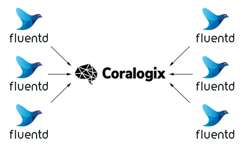

FluentD
=======

In case if you need to connect multiple servers to *Coralogix* you can use ``FluentD``.

Setup
-----

Install ``FluentD``:

DEB
~~~

.. code-block:: bash

    export OS=$(lsb_release -si | tr '[:upper:]' '[:lower:]')
    export RELEASE=$(lsb_release -sc)
    curl -L https://toolbelt.treasuredata.com/sh/install-${OS}-${RELEASE}-td-agent3.sh | sudo sh

RPM
~~~

.. code-block:: bash

    curl -L https://toolbelt.treasuredata.com/sh/install-redhat-td-agent3.sh | sudo sh

Install ``fluent-plugin-coralogix``:

.. code-block:: bash

    sudo td-agent-gem install fluent-plugin-coralogix

Configuration
-------------

Configuration for the ``FluentD`` is located at ``/etc/td-agent/td-agent.conf``.

Configuration examples can be found `here <https://github.com/coralogix/integrations-docs/tree/master/examples/fluentd/configs>`_.

Single file
~~~~~~~~~~~

**/etc/td-agent/td-agent.conf:**

.. code-block:: ruby

    <source>
      @type tail
      path /var/log/nginx/access.log
      pos_file /var/log/td-agent/nginx-access.log.pos
      tag access
      <parse>
        @type none
      </parse>
    </source>

    <match access.**>
      @type coralogix
      @id coralogix
      @log_level warn
      privatekey "#{ENV['PRIVATE_KEY']}"
      appname "nginx"
      subsystemname "access"
      log_key_name message
      is_json false
    </match>

Multiple files
~~~~~~~~~~~~~~

**/etc/td-agent/td-agent.conf:**

.. code-block:: ruby

    <source>
      @type tail
      path /var/log/nginx/access.log
      pos_file /var/log/td-agent/nginx-access.log.pos
      tag access
      <parse>
        @type none
      </parse>
    </source>

    <source>
      @type tail
      path /var/log/nginx/error.log
      pos_file /var/log/td-agent/nginx-error.log.pos
      tag error
      <parse>
        @type multiline
        format_firstline /^\d{4}\/\d{2}\/\d{2}/
        format1 /(?<message>.*)/
      </parse>
    </source>

    <filter **>
      @type record_transformer
      <record>
        tag ${tag}
      </record>
    </filter>

    <match {access,error}.**>
      @type coralogix
      @id coralogix
      @log_level warn
      privatekey "#{ENV['PRIVATE_KEY']}"
      appname "nginx"
      subsystemname "$tag"
      log_key_name message
      is_json false
    </match>

JSON file
~~~~~~~~~

**/etc/td-agent/td-agent.conf:**

.. code-block:: ruby

    <source>
      @type tail
      path /var/log/application.log
      pos_file /var/log/td-agent/application.log.pos
      tag application
      <parse>
        @type json
      </parse>
    </source>

    <match application.**>
      @type coralogix
      @id coralogix
      @log_level warn
      privatekey "#{ENV['PRIVATE_KEY']}"
      appname "production"
      subsystemname "application"
      is_json true
    </match>

Nested JSON field
~~~~~~~~~~~~~~~~~

**/etc/td-agent/td-agent.conf:**

.. code-block:: ruby

    <source>
      @type tail
      path /var/log/application.log
      pos_file /var/log/td-agent/application.log.pos
      tag application
      <parse>
        @type json
      </parse>
    </source>

    <filter **>
      @type record_transformer
      enable_ruby
      <record>
        log ${JSON.parse(record["log"]) rescue record["log"]}
      </record>
    </filter>

    <match application.**>
      @type coralogix
      @id coralogix
      @log_level warn
      privatekey "#{ENV['PRIVATE_KEY']}"
      appname "production"
      subsystemname "application"
      is_json true
    </match>

Starting
--------

Start the ``FluentD``:

.. code-block:: bash

    sudo systemctl start td-agent
