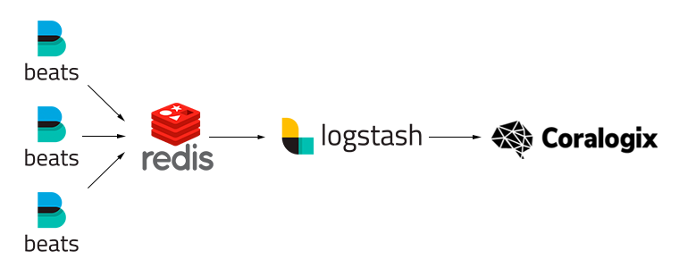

Logstash
========

In case if you already use or planning to use ``ELK`` stack, it will be easy to integrate it with *Coralogix*.

Setup
-----

For the installation of the ``Logstash`` and ``Filebeat`` you should add ``Elastic`` repository.

DEB
~~~

.. code-block:: bash

    wget -qO - https://artifacts.elastic.co/GPG-KEY-elasticsearch | sudo apt-key add && \
    sudo apt-get install apt-transport-https && \
    echo "deb https://artifacts.elastic.co/packages/7.x/apt stable main" | sudo tee -a /etc/apt/sources.list.d/elastic-7.x.list && \
    sudo apt-get update

RPM
~~~

.. code-block:: bash

    sudo rpm --import https://artifacts.elastic.co/GPG-KEY-elasticsearch && \
    sudo cat > /etc/yum.repos.d/elastic.repo << EOL
    [elastic-7.x]
    name=Elastic repository for 7.x packages
    baseurl=https://artifacts.elastic.co/packages/7.x/yum
    gpgcheck=1
    gpgkey=https://artifacts.elastic.co/GPG-KEY-elasticsearch
    enabled=1
    autorefresh=1
    type=rpm-md
    EOL

Install ``Filebeat`` on all of your machines:

DEB
~~~

.. code-block:: bash

    sudo apt-get install -y filebeat

RPM
~~~

.. code-block:: bash

    sudo yum -y install filebeat

Install ``Logstash`` on your centralized logging server:

DEB
~~~

.. code-block:: bash

    sudo apt-get install -y logstash

RPM
~~~

.. code-block:: bash

    sudo yum -y install logstash

Install `logstash-output-coralogix <https://github.com/coralogix/logstash-output-coralogix>`_ on your centralized logging server:

.. code-block:: bash

    sudo /usr/share/logstash/bin/logstash-plugin install logstash-output-coralogix

Configuration
-------------

There are many patterns of using ``Logstash`` and ``Filebeat`` for shipping logs to Coralogix.

Configuration for the ``Filebeat`` is located at ``/etc/filebeat/filebeat.yml``.

Configuration for the ``Logstash`` pipeline is located at ``/etc/logstash/conf.d/logstash.conf``.

Configuration examples can be found `here <https://github.com/coralogix/integrations-docs/tree/master/examples/logstash/configs>`_.

Single Logstash
~~~~~~~~~~~~~~~

**/etc/logstash/conf.d/logstash.conf:**

.. code-block:: ruby

    input {
      file {
        type => "access"
        path => "/var/log/nginx/access.log"
      }
      file {
        type => "error"
        path => "/var/log/nginx/error.log"
        codec => multiline {
          pattern => "^\d{4}\/\d{2}\/\d{2}"
          negate => true
          what => previous
        }
      }
    }

    output {
      coralogix {
        config_params => {
          "PRIVATE_KEY" => "${PRIVATE_KEY}"
          "APP_NAME" => "nginx"
          "SUB_SYSTEM" => "$type"
        }
        log_key_name => "message"
        is_json => false
      }
    }

Filebeat & Logstash
~~~~~~~~~~~~~~~~~~~

.. image:: images/2.png
   :alt: Filebeat & Logstash
   :align: center

**/etc/filebeat/filebeat.yml:**

.. code-block:: yaml

    filebeat.inputs:
    - type: log
      paths:
      - "/var/log/nginx/access.log"
      fields_under_root: true
      fields:
        APP_NAME: nginx
        SUB_SYSTEM: access
    - type: log
      paths:
      - "/var/log/nginx/error.log"
      multiline:
        pattern: '^\d{4}\/\d{2}\/\d{2}'
        negate: true
        match: after
      fields_under_root: true
      fields:
        APP_NAME: nginx
        SUB_SYSTEM: error

    output.logstash:
      hosts: ["logstash:5044"]

**/etc/logstash/conf.d/logstash.conf:**

.. code-block:: ruby

    input {
      beats {
        port => 5044
      }
    }

    output {
      coralogix {
        config_params => {
          "PRIVATE_KEY" => "${PRIVATE_KEY}"
          "APP_NAME" => "$APP_NAME"
          "SUB_SYSTEM" => "$SUB_NAME"
        }
        is_json => true
      }
    }

Filebeat & Kafka & Logstash
~~~~~~~~~~~~~~~~~~~~~~~~~~~

.. image:: images/3.png
   :alt: Filebeat & Kafka & Logstash
   :align: center

**/etc/filebeat/filebeat.yml:**

.. code-block:: yaml

    filebeat.inputs:
    - type: log
      paths:
      - "/var/log/nginx/access.log"
      fields_under_root: true
      fields:
        APP_NAME: nginx
        SUB_SYSTEM: access
    - type: log
      paths:
      - "/var/log/nginx/error.log"
      multiline:
        pattern: '^\d{4}\/\d{2}\/\d{2}'
        negate: true
        match: after
      fields_under_root: true
      fields:
        APP_NAME: nginx
        SUB_SYSTEM: error

    output.kafka:
      hosts: ["kafka:9092"]
      topic: "filebeat"

**/etc/logstash/conf.d/logstash.conf:**

.. code-block:: ruby

    input {
      kafka {
        bootstrap_servers => "kafka:9092"
        topics => ["filebeat"]
        codec => json
      }
    }

    output {
      coralogix {
        config_params => {
          "PRIVATE_KEY" => "${PRIVATE_KEY}"
          "APP_NAME" => "$APP_NAME"
          "SUB_SYSTEM" => "$SUB_NAME"
        }
        is_json => true
      }
    }

Filebeat & Redis & Logstash
~~~~~~~~~~~~~~~~~~~~~~~~~~~

**/etc/filebeat/filebeat.yml:**

.. code-block:: yaml

    filebeat.inputs:
    - type: log
      paths:
      - "/var/log/nginx/access.log"
      fields_under_root: true
      fields:
        APP_NAME: nginx
        SUB_SYSTEM: access
    - type: log
      paths:
      - "/var/log/nginx/error.log"
      multiline:
        pattern: '^\d{4}\/\d{2}\/\d{2}'
        negate: true
        match: after
      fields_under_root: true
      fields:
        APP_NAME: nginx
        SUB_SYSTEM: error

    output.redis:
      hosts: ["redis:6379"]
      key: "filebeat"

**/etc/logstash/conf.d/logstash.conf:**

.. code-block:: ruby

    input {
      redis {
        host => "redis"
        port => 6379
        key => "filebeat"
        data_type => "list"
        codec => json
      }
    }

    output {
      coralogix {
        config_params => {
          "PRIVATE_KEY" => "${PRIVATE_KEY}"
          "APP_NAME" => "$APP_NAME"
          "SUB_SYSTEM" => "$SUB_NAME"
        }
        is_json => true
      }
    }

Starting
--------

Start the ``Logstash`` on the centralized logging server:

.. code-block:: bash

    sudo systemctl start filebeat

Start the ``Filebeat`` on each machine with logs:

.. code-block:: bash

    sudo systemctl start filebeat
