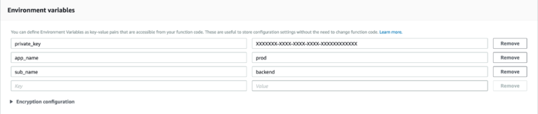
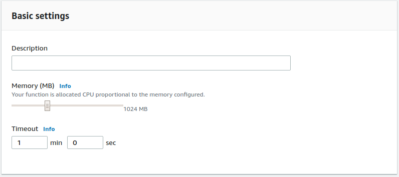

AWS VPC Flow Logs
=================

*Coralogix* provides a predefined Lambda function to forward your ``AWS Cloud Trail`` logs straight to *Coralogix*.

Setup
-----

1. Create ``AWS Cloud Trail`` trail and setup storage in your S3 bucket:

2. Create an ``“author from scratch”`` Node.js 8.10 runtime lambda with an S3 read permissions:

.. image:: images/1.png
   :alt: Lambda settings

3. At ``“Code entry type”`` choose ``“Upload a ZIP file”`` and upload ``“s3ToCoralogixVPC.zip”``:

`<https://s3-eu-west-1.amazonaws.com/coralogix-public/tools/s3ToCoralogixCloudTrail.zip>`_

4. Add the mandatory environment variables: ``private_key``, ``app_name``, ``sub_name``:

* **Private Key** – A unique ID which represents your company, this Id will be sent to your mail once you register to *Coralogix*.

* **Application Name** – Used to separate your environment, e.g. *SuperApp-test/SuperApp-prod*.

* **SubSystem Name** – Your application probably has multiple subsystems, for example, *Backend servers, Middleware, Frontend servers etc*.

5. Choose the S3 bucket you want to get triggered by and change the event type from ``“PUT”`` to ``“Object Created(All)”``:

6. Increase ``Memory`` to ``1024MB`` and ``Timeout`` to ``1min``:

7. Click ``“Save”``.