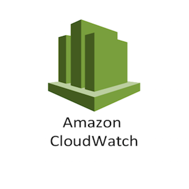
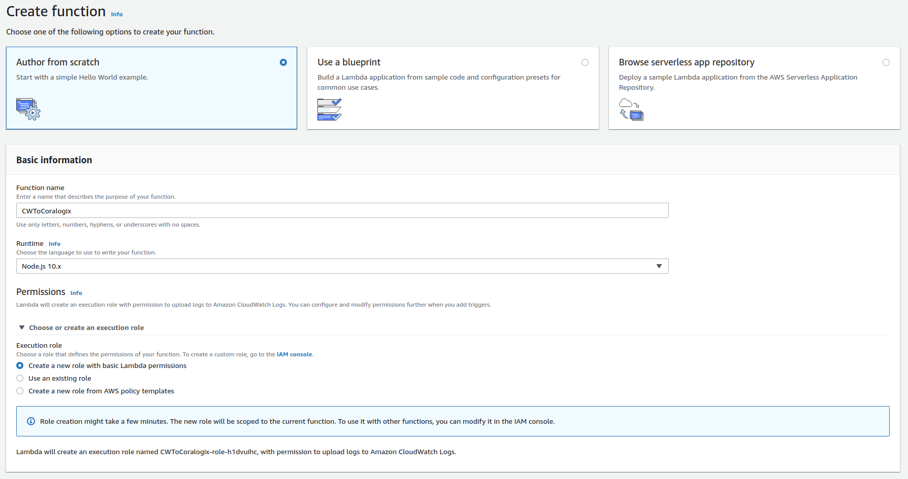
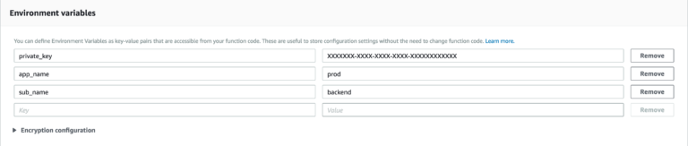
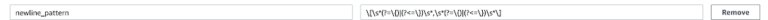
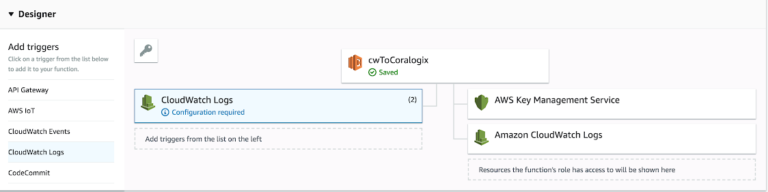
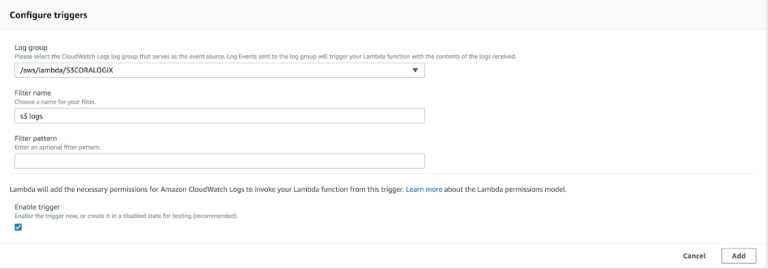
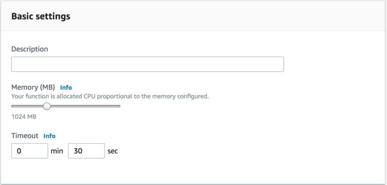
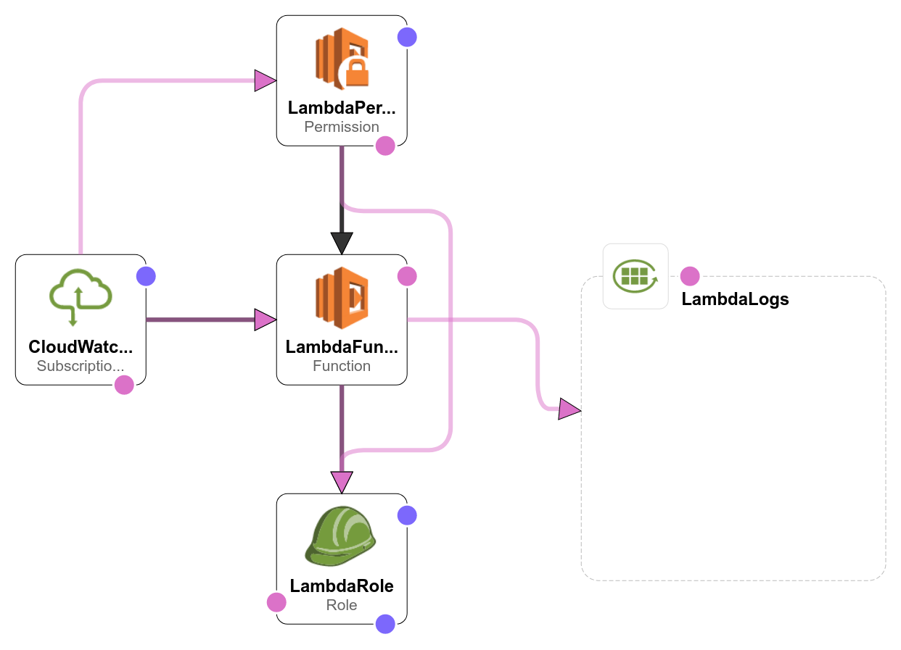

AWS CloudWatch Logs
===================

*Coralogix* provides a predefined Lambda function to forward your ``CloudWatch`` logs straight to *Coralogix*.

Setup
-----

Manually
~~~~~~~~

1. Create an ``“author from scratch”`` Node.js 10.x runtime lambda with basic permissions:

2. At ``“Code entry type”`` choose ``“Edit code inline”`` and paste the `function code <https://github.com/coralogix/integrations-docs/blob/master/integrations/aws/cloudwatch/lambda/cw.js>`_.

3. Add the mandatory environment variables: ``private_key``, ``app_name``, ``sub_name``:

* **Private Key** – A unique ID which represents your company, this Id will be sent to your mail once you register to *Coralogix*.

* **Application Name** – Used to separate your environment, e.g. *SuperApp-test/SuperApp-prod*.

* **SubSystem Name** – Your application probably has multiple subsystems, for example, *Backend servers, Middleware, Frontend servers etc*.

**Note:** If you have a multiline messages you may need to pass ``newline_pattern`` environment variable with regular expression to split your logs records.

4. Go to ``“Add triggers”`` and add ``“CloudWatch logs”``:

5.Configure the trigger, select the desired ``“Log group”`` and give it a name:

6. Increase ``Memory`` to ``1024MB`` and ``Timeout`` to ``30 sec``:

6. Click ``“Save”``.

Terraform
~~~~~~~~~

`Here <https://github.com/coralogix/integrations-docs/tree/master/integrations/aws/cloudwatch/terraform>`_ is presented the ``Terraform`` module to deploy ``Lambda Function``.

Add this module to your manifest and change its options:

.. code-block:: terraform

    provider "aws" {
      region = "eu-west-1"
    }

    module "cw_to_coralogix" {
      source =  "git::https://github.com/coralogix/integrations-docs.git//integrations/aws/cloudwatch/terraform"

      private_key = "YOUR_PRIVATE_KEY"
      app_name    = "APP_NAME"
      log_group   = "YOUR_LOG_GROUP_NAME"
    }

Download module and apply this changes:

.. code-block:: bash

    $ terraform init
    $ terraform apply

CloudFormation
~~~~~~~~~~~~~~

`Here <https://github.com/coralogix/integrations-docs/blob/master/integrations/aws/cloudwatch/cloudformation/template.yaml>`_ is presented the ``CloudFormation`` template to deploy ``Lambda Function``.

To setup the function, execute this:

.. code-block:: bash

    $ curl -sSL -o cwToCoralogix.yaml https://raw.githubusercontent.com/coralogix/integrations-docs/module/integrations/aws/cloudwatcg/cloudformation/template.yaml
    $ aws cloudformation deploy \
        --region eu-west-1 \
        --template-file ./cwToCoralogix.yaml \
        --stack-name CWToCoralogix \
        --capabilities CAPABILITY_NAMED_IAM \
        --parameter-overrides \
            PrivateKey=YOUR_PRIVATE_KEY \
            ApplicationName=APP_NAME \
            CloudWatchLogGroupName=YOUR_LOG_GROUP_NAME
