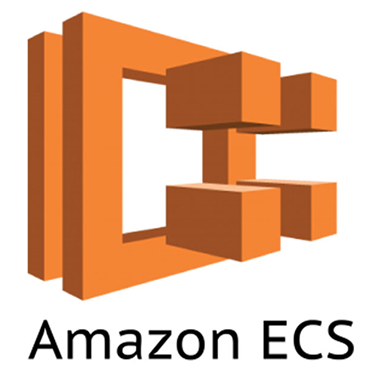
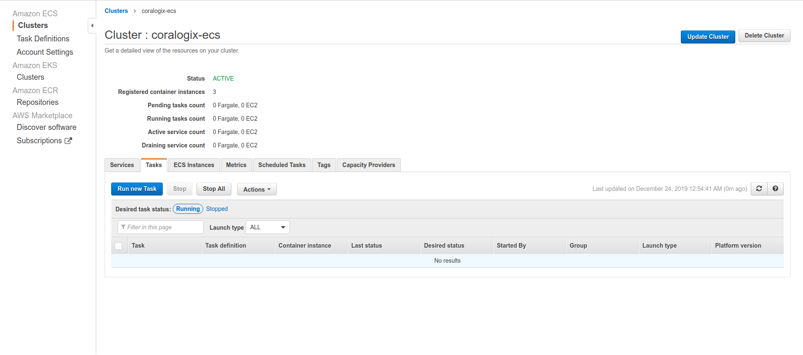
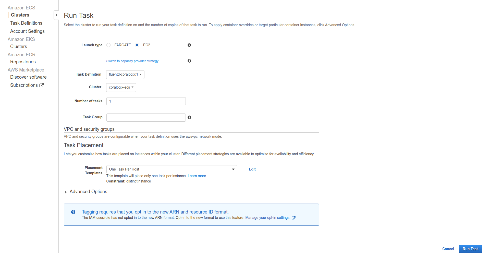
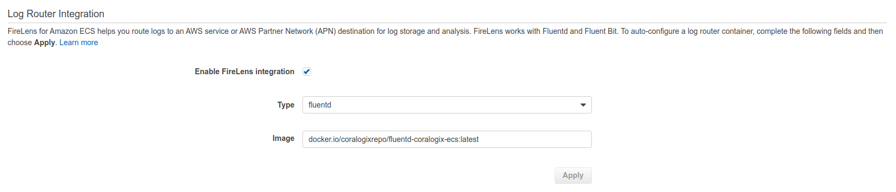
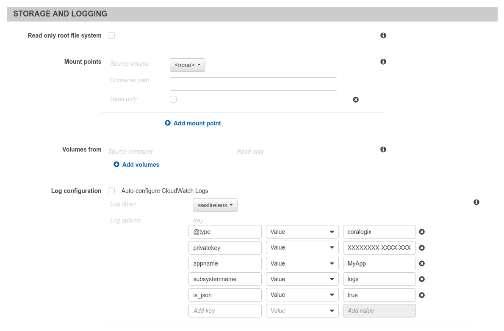

AWS ECS(EC2) Logs
=================

*Coralogix* provides integration to collect and send your ``ECS`` cluster logs straight to *Coralogix*.

General
-------

**Private Key** – A unique ID which represents your company, this ID will be sent to your email once you sign up to *Coralogix* and can also be found under settings > send your logs.

**Application Name** – The name of your main application, for example, a company named *“SuperData”* would probably insert the *“SuperData”* string parameter or if they want to debug their test environment they might insert the *“SuperData– Test”*.

**SubSystem Name** – Your application probably has multiple subsystems, for example: Backend servers, Middleware, Frontend servers etc. in order to help you examine the data you need, inserting the subsystem parameter is vital.

Setup
-----

Coralogix provides an integration both to ``EC2`` and ``Fargate`` based clusters.

EC2
~~~

1. Create an ``AWS ECS Task Definition`` from `predefined <tasks/fluentd-coralogix.json>`_ file and pass
your *Coralogix* private key as an environment variable(**PRIVATE_KEY**).
Optionally you can pass your application name as **APP_NAME**.

2. Run ``AWS ECS Task`` on your cluster:

Choose ``Placement Template`` as ``One Task Per Host``:

When the task is ready, logs will start shipping to *Coralogix*.

Fargate
~~~~~~~

1. Create a new ``AWS ECS Task Definition`` or a ``New revision`` and enable ``FireLens`` integration:

**Required parameters:**

* ``Type`` - ``fluentd``
* ``Image`` - ``docker.io/coralogixrepo/fluentd-coralogix-ecs:latest``

2. Configure ``awsfirelens`` logging driver for the container which you want to send the logs:

**Required parameters:**

* ``@type`` - ``coralogix``
* ``privatekey`` - your *Coralogix* private key
* ``appname`` - your application name
* ``subsystemname`` - your application subsystem
* ``is_json`` - ``true``

If you want to send just the log message itself without additional metadata:

* ``log_key_name`` - ``log``
* ``is_json`` - ``false``

**Note:** To manage multiline messages refer to `this <https://github.com/aws-samples/amazon-ecs-firelens-examples/tree/master/examples/fluentd/multiline-logs>`_ page.
