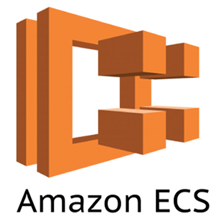
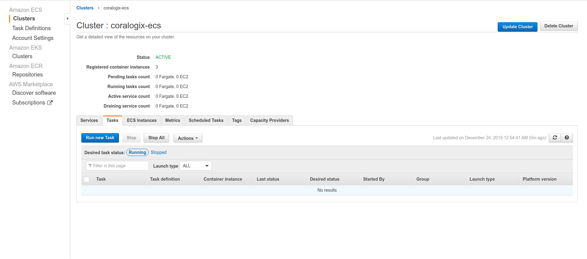
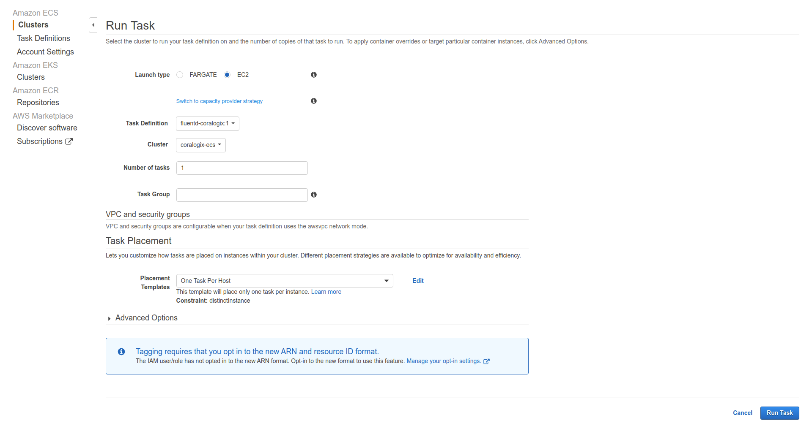

AWS ECS(EC2) Logs
=================

*Coralogix* provides a service  to collect and send your ``ECS`` cluster(based on ``EC2``) logs straight to *Coralogix*.

Setup
-----

1. Create ``AWS ECS Task Definition`` from `predefined <tasks/fluentd-coralogix.json>`_ file and pass
your *Coralogix* private key as environment variable(**PRIVATE_KEY**).
Optionally you can pass your application name as **APP_NAME**.

2. Run ``AWS ECS Task`` on your cluster:

Choose ``Placement Template`` as ``One Task Per Host``:

When task will be ready, logs will be shipped to *Coralogix*.
