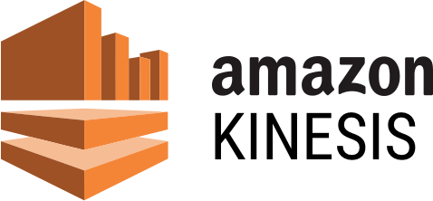
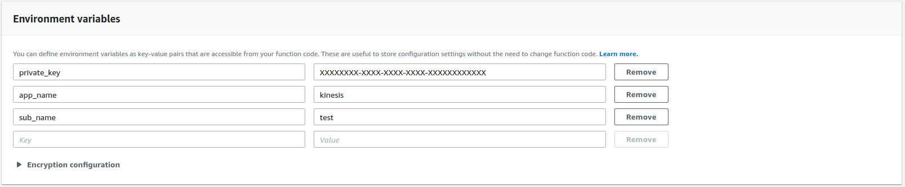
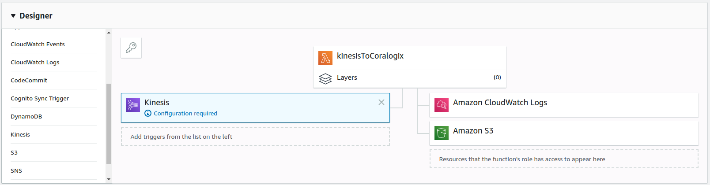
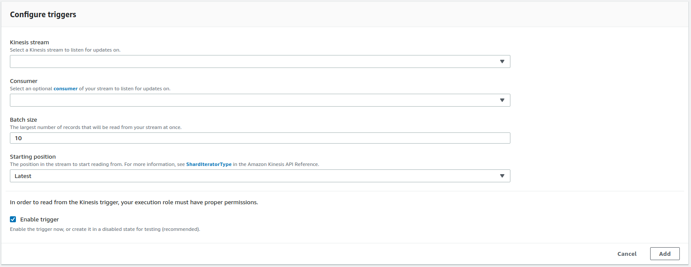
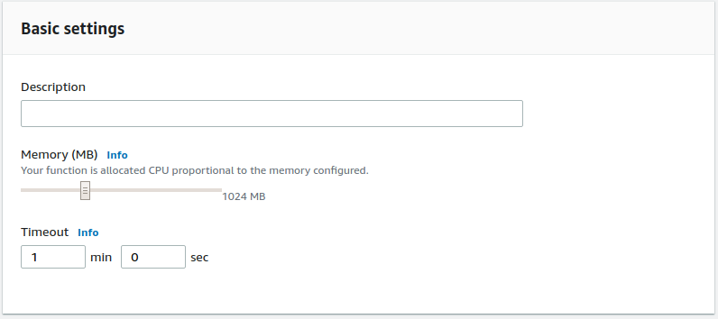

AWS Kinesis with Lambda function
================================

*Coralogix* provides a predefined Lambda function to forward your ``Kinesis`` stream straight to *Coralogix*.

Setup
-----

1. Create an ``“author from scratch”`` Node.js 8.10 runtime lambda with the following permissions(`Create execution role tutorial <https://docs.aws.amazon.com/en_us/lambda/latest/dg/lambda-intro-execution-role.html>`_):

    * `kinesis:DescribeStream <https://docs.aws.amazon.com/kinesis/latest/APIReference/API_DescribeStream.html>`_
    * `kinesis:DescribeStreamSummary <https://docs.aws.amazon.com/kinesis/latest/APIReference/API_DescribeStreamSummary.html>`_
    * `kinesis:GetRecords <https://docs.aws.amazon.com/kinesis/latest/APIReference/API_GetRecords.html>`_
    * `kinesis:GetShardIterator <https://docs.aws.amazon.com/kinesis/latest/APIReference/API_GetShardIterator.html>`_
    * `kinesis:ListShards <https://docs.aws.amazon.com/kinesis/latest/APIReference/API_ListShards.html>`_
    * `kinesis:ListStreams <https://docs.aws.amazon.com/kinesis/latest/APIReference/API_ListStreams.html>`_
    * `kinesis:SubscribeToShard <https://docs.aws.amazon.com/kinesis/latest/APIReference/API_SubscribeToShard.html>`_

2. At ``“Code entry type”`` choose ``“Edit code inline”`` and paste the `following function <https://raw.githubusercontent.com/coralogix/integrations-docs/master/integrations/aws/kinesis/lambda/kinesis.js>`_:

.. code-block:: javascript

    'use strict';

    const AWS = require('aws-sdk');
    const https = require('https');
    const assert = require('assert');

    assert(process.env.private_key, 'No private key')
    const appName = process.env.app_name ? process.env.app_name : 'NO_APPLICATION';
    const subName = process.env.sub_name ? process.env.sub_name : 'NO_SUBSYSTEM';

    exports.handler = (event, context, callback) => {

        function parseEvent(streamEventRecord) {
            let streamEventData = new Buffer(streamEventRecord.kinesis.data, 'base64').toString('ascii');
            return {
                "timestamp": streamEventRecord.kinesis.approximateArrivalTimestamp * 1000,
                "severity": getSeverityLevel(streamEventData),
                "text": streamEventData
            };
        }

        function postEventsToCoralogix(parsedEvents) {
            try {
                var options = {
                    hostname: 'api.coralogix.com',
                    port: 443,
                    path: '/api/v1/logs',
                    method: 'POST',
                    headers: {
                        'Content-Type': 'application/json',
                    }
                };

                let retries = 3;
                let timeoutMs = 10000;
                let retryNum = 0;
                let sendRequest = function sendRequest() {
                    let req = https.request(options, function (res) {
                        console.log('Status: ' + res.statusCode);
                        console.log('Headers: ' + JSON.stringify(res.headers));
                        res.setEncoding('utf8');
                        res.on('data', function (body) {
                            console.log('Body: ' + body);
                        });
                    });

                    req.setTimeout(timeoutMs, () => {
                        req.abort();
                        if (retryNum++ < retries) {
                            console.log('problem with request: timeout reached. retrying ' + retryNum + '/' + retries);
                            sendRequest();
                        } else {
                            console.log('problem with request: timeout reached. failed all retries.');
                        }
                    });

                    req.on('error', function (e) {
                        console.log('problem with request: ' + e.message);
                    });

                    req.write(JSON.stringify(parsedEvents));
                    req.end();
                }

                sendRequest();
            } catch (ex) {
                console.log(ex.message);
                callback(ex.message);
            }
        }

        function getSeverityLevel(message) {
            var severity = 3;

            if(message.includes('debug'))
                severity = 1
            if(message.includes('verbose'))
                severity = 2
            if(message.includes('info'))
                severity = 3
            if(message.includes('warn') || message.includes('warning'))
                severity = 4
            if(message.includes('error'))
                severity = 5
            if(message.includes('critical') || message.includes('panic'))
                severity = 6

            return severity;
        }

        postEventsToCoralogix({
            "privateKey": process.env.private_key,
            "applicationName": appName,
            "subsystemName": subName,
            "logEntries": event.Records.map((eventRecord) => parseEvent(eventRecord))
        });
    };

3. Add the mandatory environment variables:

    * **Private Key** – A unique ID which represents your company, this Id will be sent to your mail once you register to *Coralogix*.

    * **Application Name** – Used to separate your environment, e.g. *SuperApp-test/SuperApp-prod*.

    * **SubSystem Name** – Your application probably has multiple subsystems, for example, *Backend servers, Middleware, Frontend servers etc*.

4. Go to Add triggers and add ``Kinesis``:

5. Configure the trigger, select the desired ``“Kinesis stream”`` and ``“Consumer”``, change ``“Batch size”`` equals to ``10``:

6. Increase ``Memory`` to ``1024MB`` and ``Timeout`` to ``1 min``.

7. Click ``“Save”``
