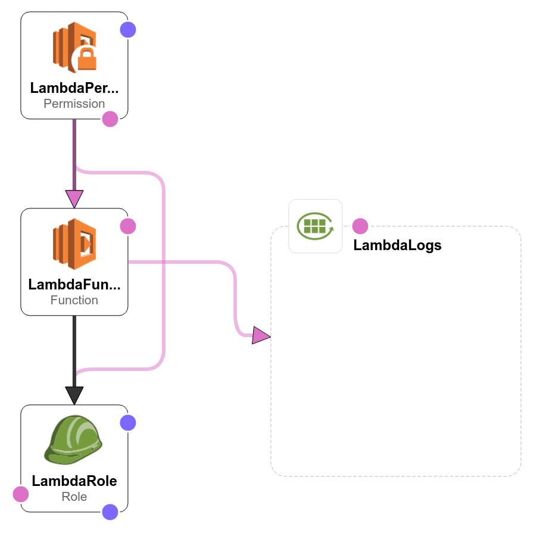

AWS S3 Logs
===========

.. image:: images/amazon-s3.png
   :height: 50px
   :width: 100px
   :scale: 50 %
   :alt: AWS S3 Logs
   :align: left
   :target: https://aws.amazon.com/s3/

*Coralogix* provides a predefined Lambda function to forward your ``S3`` logs straight to *Coralogix*.

Setup
-----

Manually
~~~~~~~~

1. Create an ``“author from scratch”`` Node.js 10.x runtime lambda with an S3 read permissions:

.. image:: images/1.png
   :alt: Lambda settings

2. At ``“Code entry type”`` choose ``“Upload a ZIP file”`` and upload ``“s3ToCoralogix.zip”``:

`<https://s3-eu-west-1.amazonaws.com/coralogix-public/tools/s3ToCoralogix.zip>`_

.. image:: images/2.png
   :alt: Lambda code upload

3. Add the mandatory environment variables: ``private_key``, ``app_name``, ``sub_name``:

* **Private Key** – A unique ID which represents your company, this Id will be sent to your mail once you register to *Coralogix*.

* **Application Name** – Used to separate your environment, e.g. *SuperApp-test/SuperApp-prod*.

* **SubSystem Name** – Your application probably has multiple subsystems, for example, *Backend servers, Middleware, Frontend servers etc*.

.. image:: images/3.png
   :alt: Lambda environment variables

**Note:** If you have a multiline messages you may need to pass ``newline_pattern`` environment variable with regular expression to split your logs records.

.. image:: images/4.png
   :alt: Lambda multiline pattern

4. Choose the S3 bucket you want to get triggered by and change the event type from ``“PUT”`` to ``“Object Created(All)”``:

.. image:: images/5.png
   :alt: Lambda trigger setup

5. Increase ``Memory`` to ``1024MB`` and ``Timeout`` to ``30 sec``:

.. image:: images/6.png
   :alt: Lambda basic settings

6. Click ``“Save”``.

AWS CLI
~~~~~~~

To setup the function, execute this:

.. code-block:: bash

    $ curl -sSL -o s3ToCoralogix.zip https://s3-eu-west-1.amazonaws.com/coralogix-public/tools/s3ToCoralogix.zip
    $ aws iam create-role \
        --region eu-central-1 \
        --role-name S3ReadOnly2 \
        --path /service-role/ \
        --assume-role-policy-document '{"Version":"2012-10-17","Statement":{"Effect":"Allow","Principal":{"Service":"lambda.amazonaws.com"},"Action":"sts:AssumeRole"}}' \
        --output text \
        --query 'Role.Arn'
    $ aws iam put-role-policy \
        --region eu-central-1 \
        --role-name S3ReadOnly2 \
        --policy-name S3ReadOnlyPolicy \
        --policy-document '{"Version":"2012-10-17","Statement":[{"Effect":"Allow","Action":["s3:GetObject"],"Resource":"arn:aws:s3:::*"}]}'
    $ aws lambda create-function \
        --region eu-central-1 \
        --function-name s3ToCoralogix \
        --runtime nodejs8.10 \
        --memory-size 1024 \
        --timeout 30 \
        --handler index.handler \
        --zip-file fileb://s3ToCoralogix.zip \
        --environment 'Variables={private_key=YOUR_PRIVATE_KEY,app_name=APP_NAME,sub_name=SUB_NAME}' \
        --role ROLE_ARN \
        --publish \
        --output text \
        --query 'FunctionArn'
    $ aws lambda add-permission \
        --region eu-central-1 \
        --function-name s3ToCoralogix \
        --statement-id allow-s3-to-invoke \
        --action lambda:InvokeFunction \
        --principal s3.amazonaws.com \
        --source-arn arn:aws:s3:::YOUR_BUCKET_NAME \
        --source-account AWS_ACCOUNT_ID
    $ aws s3api put-bucket-notification-configuration \
        --region eu-central-1 \
        --bucket YOUR_BUCKET_NAME \
        --notification-configuration 'LambdaFunctionConfigurations=[{LambdaFunctionArn=FUNCTION_ARN,Events=[s3:ObjectCreated:*]}]'

CloudFormation
~~~~~~~~~~~~~~

`Here <https://github.com/coralogix/integrations-docs/blob/master/integrations/aws/s3/cloudformation/template.yaml>`_ is presented the ``CloudFormation`` template to deploy ``Lambda Function``.

To setup the function, execute this:

.. code-block:: bash

    $ curl -sSL -o s3ToCoralogix.yaml https://raw.githubusercontent.com/coralogix/integrations-docs/module/integrations/aws/s3/cloudformation/template.yaml
    $ aws cloudformation deploy \
        --region eu-west-1 \
        --template-file ./s3ToCoralogix.yaml \
        --stack-name S3ToCoralogix \
        --capabilities CAPABILITY_NAMED_IAM \
        --parameter-overrides \
            PrivateKey=YOUR_PRIVATE_KEY \
            ApplicationName=APP_NAME \
            SubsystemName=SUB_NAME \
            S3BucketName=YOUR_BUCKET_NAME
    $ aws cloudformation describe-stacks \
        --region eu-west-1 \
        --stack-name S3ToCoralogix \
        --output text \
        --query "Stacks[0].Outputs[?OutputKey=='LambdaArn'].OutputValue"
    $ aws s3api put-bucket-notification-configuration \
        --region eu-west-1 \
        --bucket YOUR_BUCKET_NAME \
        --notification-configuration 'LambdaFunctionConfigurations=[{LambdaFunctionArn=FUNCTION_ARN,Events=[s3:ObjectCreated:*]}]'
