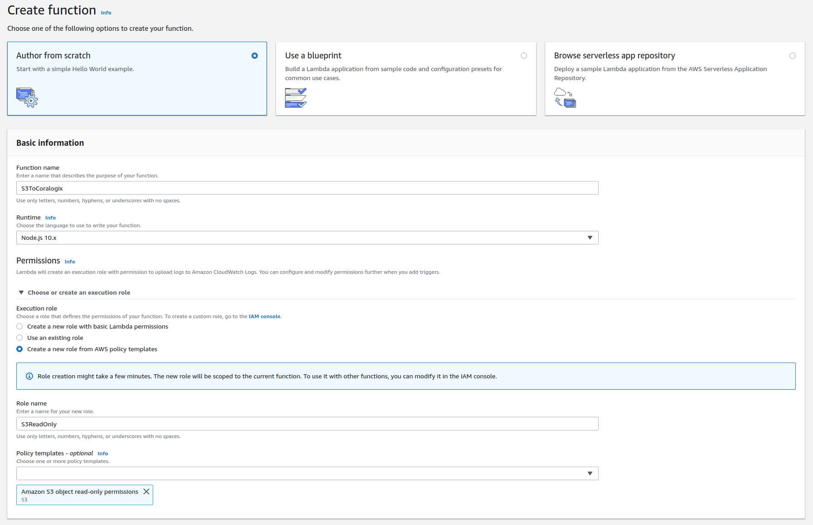
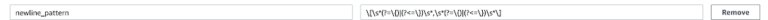
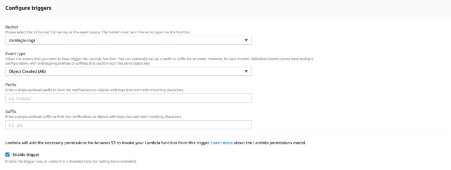
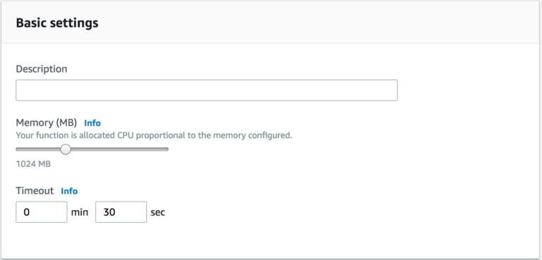

AWS S3 Logs
===========

.. image:: images/s3.png
   :height: 50px
   :width: 100px
   :scale: 50 %
   :alt: AWS S3 Logs
   :align: left
   :target: https://aws.amazon.com/ru/s3/

*Coralogix* provides a predefined Lambda function to forward your ``S3`` logs straight to *Coralogix*.

Setup
-----

1. Create an ``“author from scratch”`` Node.js 8.10 runtime lambda with an S3 read permissions:

2. At ``“Code entry type”`` choose ``“Upload a ZIP file”`` and upload ``“s3ToCoralogix.zip”``:

`<https://s3-eu-west-1.amazonaws.com/coralogix-public/tools/s3ToCoralogixzip>`_

.. image:: images/2.png
   :alt: Lambda code upload

3. Add the mandatory environment variables: ``private_key``, ``app_name``, ``sub_name``:

* **Private Key** – A unique ID which represents your company, this Id will be sent to your mail once you register to *Coralogix*.

* **Application Name** – Used to separate your environment, e.g. *SuperApp-test/SuperApp-prod*.

* **SubSystem Name** – Your application probably has multiple subsystems, for example, *Backend servers, Middleware, Frontend servers etc*.

.. image:: images/3.png
   :alt: Lambda environment variables

**Note:** If you have a multiline messages you may need to pass ``newline_pattern`` environment variable with regular expression to split your logs records.

4. Choose the S3 bucket you want to get triggered by and change the event type from ``“PUT”`` to ``“Object Created(All)”``:

5. Increase ``Memory`` to ``1024MB`` and ``Timeout`` to ``30 sec``:

6. Click ``“Save”``.
