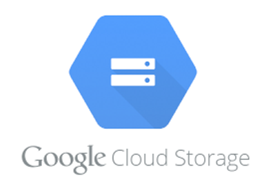
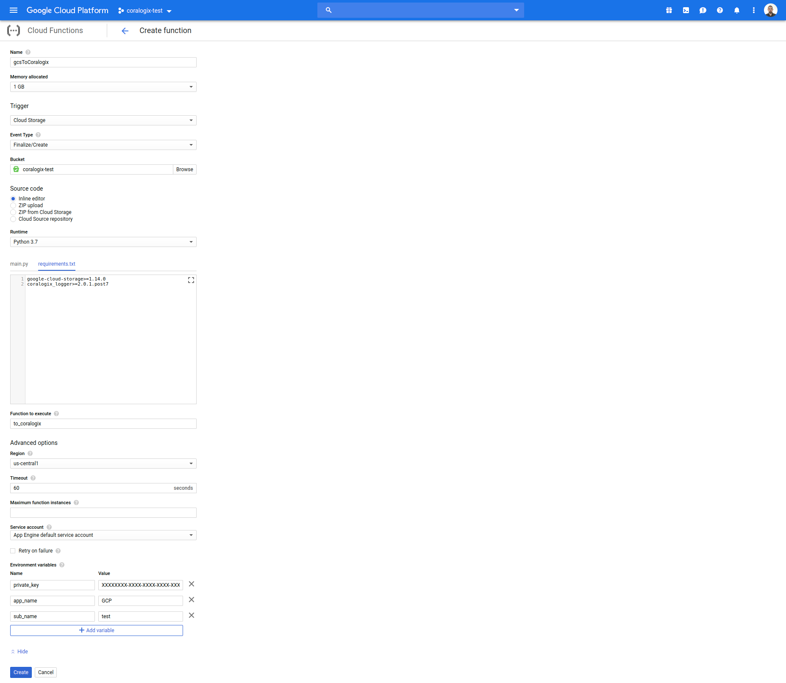

Google Cloud Storage
====================

*Coralogix* provides a predefined function to forward your logs from ``Google Cloud Storage`` straight to *Coralogix*.

Setup
-----

Manually
~~~~~~~~

Create ``Cloud Function`` in your ``Google Cloud Console`` with following settings:

1. Increase ``“Memory allocated“`` to ``“1 GB“``.
2. Change ``“Trigger“`` to ``“Cloud Storage“``.
3. Change ``“Event Type“`` to ``“Finalize/Create“``.
4. Select your ``GCS Bucket``.
5. Change ``“Runtime“`` to ``“Python 3.7“``.
6. Paste the following code to `main.py <https://raw.githubusercontent.com/coralogix/integrations-docs/master/integrations/gcp/gcs/lambda/main.py>`_:

.. code-block:: python

    #!/usr/bin/python
    # -*- coding: utf-8 -*-

    """
    Coralogix GCP function
    Author: Coralogix Ltd.
    Email: info@coralogix.com
    """

    import os
    import re
    import sys
    import gzip
    import logging
    from google.cloud import storage
    from coralogix.handlers import CoralogixLogger

    __name__ = 'gcsToCoralogix'
    __author__ = 'Coralogix Ltd.'
    __email__ = 'info@coralogix.com'
    __copyright__ = 'Copyright 2019, Coralogix Ltd.'
    __credits__ = ['Ariel Assaraf', 'Amnon Shahar', 'Eldar Aliiev']
    __license__ = 'Apache Version 2.0'
    __version__ = '1.0.0'
    __maintainer__ = 'Coralogix Ltd.'
    __date__ = '1 April 2019'
    __status__ = 'Stable'

    # Get function parameters
    PRIVATE_KEY = os.environ.get('private_key')
    APP_NAME = os.environ.get('app_name', 'NO_APPLICATION')
    SUB_SYSTEM = os.environ.get('sub_name', 'NO_SUBSYSTEM')
    NEWLINE_PATTERN = os.environ.get('newline_pattern', '(?:\r\n|\r|\n)')

    # Function entrypoint
    def to_coralogix(event, context):
        """
        Function entrypoint
        :param event: event metadata
        :type event: dict
        :param context: event context
        :type context: dict
        """

        def get_severity(message: str) -> int:
            """
            Extract severity from message text
            :param message: log record text
            :type message: str
            :return: severity value
            :rtype: int
            """
            severity = 3
            if 'Warning' in message or 'warn' in message:
                severity = 4
            if 'Error' in message or 'Exception' in message:
                severity = 5
            return severity

        # Initialize GCS client
        client = storage.Client()

        # Initialize Coralogix logger
        logger = CoralogixLogger(
            PRIVATE_KEY,
            APP_NAME,
            SUB_SYSTEM,
            'GCP'
        )

        logging.info(f"Processing file {event['name']}")

        # Get file content
        bucket = client.get_bucket(event['bucket'])
        blob = bucket.get_blob(event['name'])
        content = blob.download_as_string()

        # Check if file is compressed
        if event['contentType'] == 'application/gzip' or \
           event['name'].endswith('.gz'):
            logging.info(f"Uncompress file {event['name']}")
            try:
                # Decompress file
                content = gzip.decompress(content)
            except Exception as exc:
                logging.fatal(f"Cannot uncompress file {event['name']}: ", exc)
                sys.exit(1)

        # Split file into line and remove empty lines
        logs = list(filter(None, re.split(NEWLINE_PATTERN, content.decode('utf-8'))))
        logging.info(f"Number of logs: {len(logs)}")

        # Send logs to Coralogix
        for log in logs:
            logger.log(
                get_severity(log),
                log,
                thread_id=f"{event['bucket']}/{event['name']}"
            )

7. Paste the following packages to `requirements.txt <https://raw.githubusercontent.com/coralogix/integrations-docs/master/integrations/gcp/gcs/lambda/requirements.txt>`_:

::

    google-cloud-storage>=1.14.0
    coralogix_logger>=2.0.1.post7

8. Increase ``“Timeout“`` to ``“60 seconds“``.
9. Add the mandatory environment variables: ``private_key``, ``app_name``, ``sub_name``:

* **Private Key** – A unique ID which represents your company, this Id will be sent to your mail once you register to *Coralogix*.

* **Application Name** – Used to separate your environment, e.g. *SuperApp-test/SuperApp-prod*.

* **SubSystem Name** – Your application probably has multiple subsystems, for example, *Backend servers, Middleware, Frontend servers etc*.

10. Multiline pattern: *Coralogix* supports multiline pattern by default, you can define a custom pattern with an environment variables, for example:

::

    newline_pattern [\s(?={)|(?<=})\s,\s(?={)|(?<=})\s\]. 

11. Click ``“Create”``.

gcloud CLI
~~~~~~~~~~

To setup the function, execute this:

.. code-block:: bash

    $ curl -sSL -o gcsToCoralogix.zip https://raw.githubusercontent.com/coralogix/integrations-docs/master/integrations/gcp/gcs/lambda/gcsToCoralogix.zip
    $ unzip gcsToCoralogix.zip -d gcsToCoralogix/
    $ gcloud functions deploy gcsToCoralogix \
        --project=YOUR_GCP_PROJECT_ID \
        --region=us-central1 \
        --runtime=python37 \
        --memory=1024MB \
        --timeout=60s \
        --entry-point=to_coralogix \
        --source=gcsToCoralogix \
        --trigger-resource=YOUR_BUCKET_NAME \
        --trigger-event=google.storage.object.finalize \
        --set-env-vars="private_key=YOUR_PRIVATE_KEY,app_name=APP_NAME,sub_name=SUB_NAME"

Terraform
~~~~~~~~~

`Here <https://raw.githubusercontent.com/coralogix/integrations-docs/master/integrations/gcp/gcs/lambda/coralogix.tf>`_ is the ``Terraform`` manifest to deploy ``Cloud Function``:

.. code-block:: terraform

    variable "private_key" {
      type        = "string"
      description = "Coralogix Private Key."
    }

    variable "app_name" {
      type        = "string"
      description = "Application name."
    }

    variable "sub_name" {
      type        = "string"
      description = "Subsystem name."
    }

    variable "bucket_name" {
      type        = "string"
      description = "Name of storage bucket to watch."
    }

    provider "google" {
      project     = "YOUR_GCP_PROJECT_ID"
      region      = "us-central1"
    }

    resource "google_storage_bucket_object" "gcs_to_coralogix_function_sources" {
      name   = "gcsToCoralogix.zip"
      bucket = "${var.bucket_name}"
      source = "./gcsToCoralogix.zip"
    }

    resource "google_cloudfunctions_function" "gcs_to_coralogix_function" {
      name                  = "${var.bucket_name}_to_coralogix"
      description           = "Cloud Function which send logs from storage bucket to Coralogix."
      runtime               = "python37"
      available_memory_mb   = 1024
      timeout               = 60
      entry_point           = "to_coralogix"
      source_archive_bucket = "${var.bucket_name}"
      source_archive_object = "${google_storage_bucket_object.gcs_to_coralogix_function_sources.name}"
      event_trigger {
        resource            = "${var.bucket_name}"
        event_type          = "google.storage.object.finalize"
      }
      environment_variables = {
        private_key = "${var.private_key}"
        app_name    = "${var.app_name}"
        sub_name    = "${var.sub_name}"
      }
    }

And apply this manifest:

.. code-block:: bash

    $ curl -sSL -o gcsToCoralogix.zip https://github.com/coralogix/integrations-docs/raw/master/integrations/gcp/gcs/lambda/gcsToCoralogix.zip
    $ terraform init
    $ terraform apply -auto-approve \
        -var 'private_key=YOUR_PRIVATE_KEY' \
        -var 'app_name=APP_NAME' \
        -var 'sub_name=SUB_NAME' \
        -var 'bucket_name=coralogix-test'
