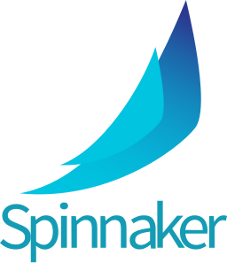

Spinnaker integration
======================

*Coralogix* provides a seamless integration with ``Spinnaker`` so you can push tags from your pipelines.

Prerequisites
-------------

* Have ``Spinnaker`` deployed, for more information on how to deploy: `<https://spinnaker.io/setup/>`_

Configuration
-------------

To create a custom webhook stage, you’ll need to add configuration for the stage in ``orca-local.yml``.

Here is a content of **orca-local.yml**:

.. code-block:: yaml

    webhook:
      preconfigured:
        - label: Coralogix Tag
          type: coralogixTag
          enabled: true
          description: Push tag to Coralogix
          parameters:
            - label: Coralogix API URL
              name: url
              type: string
              description: Coralogix API endpoint
              defaultValue: coralogix.com
            - label: Coralogix API Token
              name: token
              type: string
              description: Coralogix API Token
            - label: Tag
              name: tag
              type: string
              description: Tag Name
            - label: Application
              name: application
              type: string
              description: Application Name
            - label: Subsystem
              name: subsystem
              type: string
              description: Subsystem Name
          url: https://webapi.${parameterValues['url']}/api/v1/external/tags
          method: POST
          customHeaders:
          Authorization:
            - Bearer ${parameterValues['token']}
          Content-Type:
            - application/json
          payload: |-
            {
                "name": "${parameterValues['tag']}",
                "application": ["${parameterValues['application']}"],
                "subsystem": ["${parameterValues['subsystem']}"],
                "iconUrl": "https://raw.githubusercontent.com/coralogix/integrations-docs/master/integrations/spinnaker/images/spinnaker.png"
            }

After you create custom configuration, redeploy your ``Spinnaker`` instance with ``Halyard``:

.. code-block:: bash

    $ hal deploy apply

Usage
-----

Add new stage to push the tag to *Coralogix*:

Configure stage to push tag to your account:

**Note:** You can use Spinnaker `pipeline expressions <https://spinnaker.io/reference/pipeline/expressions/>`_ to define parameters for tag.
